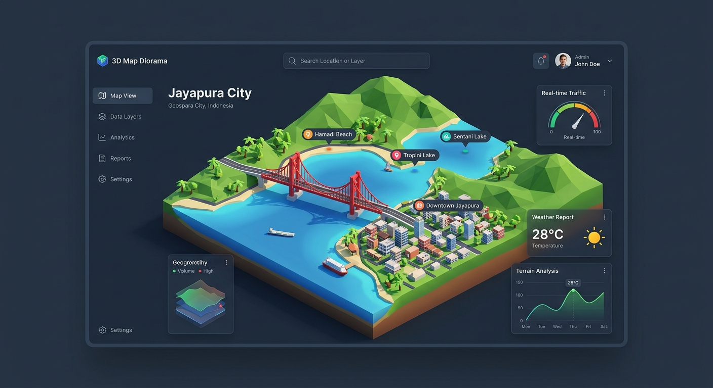

# 🗺️ 3D Map Diorama Viewer

Aplikasi visualisasi data geografis interaktif yang mengubah berkas **GeoJSON** menjadi Diorama 3D cantik berbasis Three.js dan React. Didesain dengan estetika modern, performa tinggi, dan kontrol interaktif yang kaya untuk melihat relief geografis secara realistis.



---

## ✨ Fitur Utama

- **🗺️ Diorama 3D Presisi Tinggi**: Render objek geografis secara langsung, lengkap dengan perbukitan, teluk, vegetasi, dan struktur bangunan 3D di atas papan display minimalis.
- **🇮🇩 Jayapura Papua Default**: Menampilkan visualisasi default wilayah pesisir Jayapura yang membentang indah di antara Teluk Youtefa, Jembatan Merah Youtefa yang ikonik, Kantor Gubernur, Stadion Mandala, dan perbukitan tinggi Cycloop.
- **📁 Pengunggah Berkas GeoJSON**: Dukungan uploader tangguh dengan drag-and-drop untuk berkas GeoJSON custom Anda. Sistem akan otomatis melakukan otomatisasi transformasi koordinat, normalisasi skema, dan memetakan relief kontur pegunungan secara real-time.
- **✨ Kontrol Visual Komprehensif**:
  - Pilihan alas papan pameran (Wood, Clay, Slate, Marble).
  - Skala ketinggian ekstrusi (Elevation Scale).
  - Toggle ketinggian air (Water Level) & vegetasi subur.
  - Opsi pencahayaan realistik, bayangan lembut, dan arah matahari dinamis.
- **🏙️ Presets Tambahan Dunia**: Jelajahi diorama 3D lainnya dari atas sudut pandang modern seperti:
  - **Jakarta Jantung Sudirman**: Jajaran pencakar langit SCBD yang megah dengan Monumen Nasional (Monas).
  - **Manhattan Central Park South**: Rentetan gedung super-tinggi Billionaires Row di perbatasan subur Central Park, NY.
  - **Paris Arc de Triomphe**: Desain radial arsitektur klasik abad ke-19 Paris dengan simetris jalan memukau.

---

## 🛠️ Arsitektur & Teknologi

- **React 18 + Vite** (TypeScript)
- **Three.js** (melalui integrasi langsung untuk kontrol animasi & shader yang sangat responsif)
- **Tailwind CSS** (antarmuka presisi tinggi, modern, gelap, & responsif)
- **Lucide Icons** (koleksi ikon modern & minimalis)

---

## 🚀 Cara Menjalankan Aplikasi di Lokal

### 1. Prasyarat
Pastikan Anda memiliki [Node.js](https://nodejs.org/) terinstal di sistem komputer Anda.

### 2. Instalasi Dependensi
Jalankan perintah berikut pada direktori root proyek untuk menginstal semua pustaka dependensi yang dibutuhkan:
```bash
npm install
```

### 3. Menjalankan Server Pengembangan (Local Dev)
Boot server lokal menggunakan perintah:
```bash
npm run dev
```
Aplikasi akan dapat diakses secara default di alamat virtual lokal Anda (biasanya `http://localhost:3000`).

### 4. Build untuk Produksi
Guna melakukan kompilasi versi produksi yang optimal, jalankan:
```bash
npm run build
```
Semua file statis hasil kompilasi berkinerja tinggi akan berada di direktori `dist/`.

---

## 🗄️ Format File GeoJSON yang Didukung

Aplikasi ini mendukung berkas GeoJSON standar dengan toleransi pemformatan otomatis (Auto-correct Resiliency):
- **Polygon & MultiPolygon**: Digunakan untuk menggambar batasan wilayah relief daratan serta struktur arsitektur ruko, gedung pencakar langit, stadion, maupun waduk air.
- **Point**: Untuk menambahkan pin penanda, puncak bukit, label teks melayang (billboard-style labels) di koordinat 3D.
- **Properties yang Didukung**:
  - `height`: Ketinggian ekstrusi dalam meter (untuk gedung, jembatan, bangunan).
  - `color`: Atribut warna kustom bangunan dalam kode HEX (misal: `#ff0000`).
  - `name` / `englishName`: Informasi teks penanda detail wilayah.
